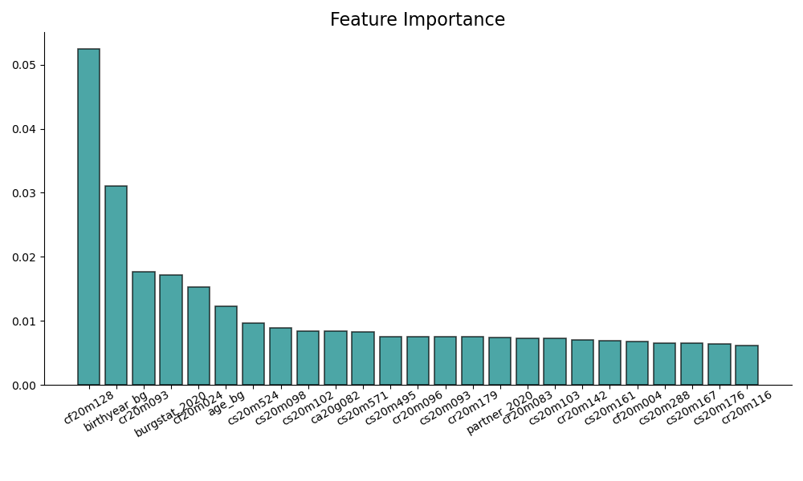
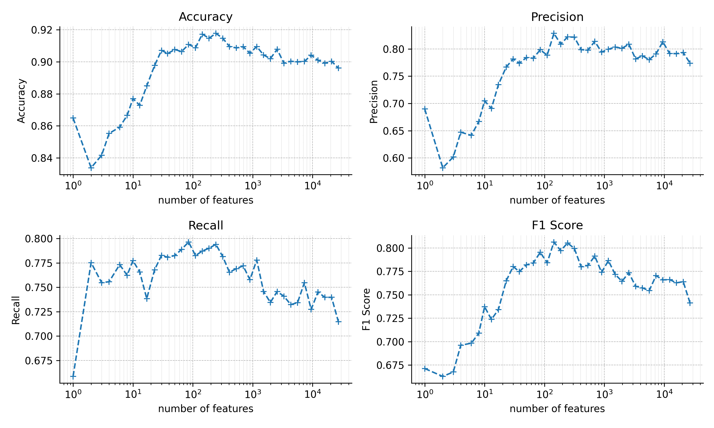
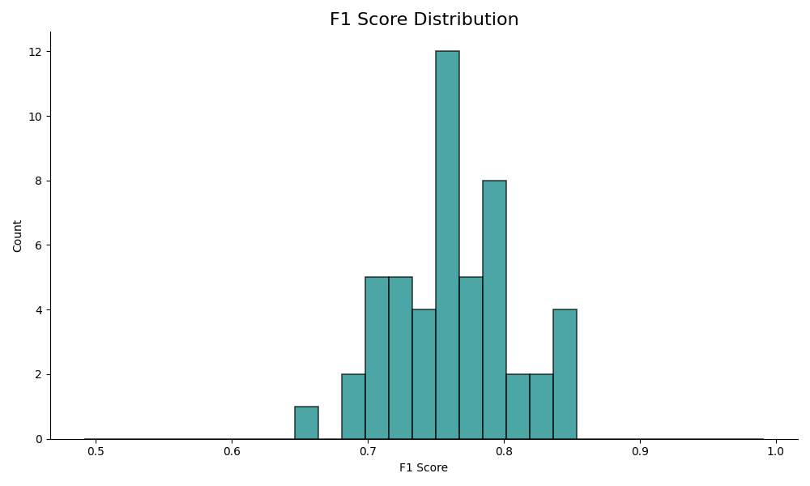

# Social Complexity Lab, PreFer Challenge [1]

We proceed in two steps:
1. We trained a gradient boosting algorithm (xgboost):
    a. To establish a strong baseline.
    b. To evaluate the predictive power of each question.
2. Our main model is an autoencoder-tabular model:
    a. To capture complex, non-linear relationships in the data.
    b. To explore new factors and interactions that traditional gradient boosting models might miss.

## Gradient Boosting as a Baseline

For xgboost, the most important parameters for the prediction task are:
1. `scale_pos_weight` to account for the unbalanced outcome.
2. `reg_lambda` for L2 regularization to avoid overfitting.

xgboost serves as a robust baseline with an `F1-score = 0.71` on the hidden validation set of round 2.

#### What Are the Important Questions?

The most important features/questions are displayed in Fig. 1. The main characteristics of these questions are:
1. `cf` code, indicating `Family & Household` type of questions.
2. `2020` most of the important questions are from the last year of the survey.

The most important question is `Within how many years do you hope to have your [first/next] child? (in 2020)`. This question remains significant across different survey years (cf. Fig. 1). This finding aligns with [2], where the author desmontrate that task-specific information outperforms surveillance-style big data for predicting academic performance. 

<figure>
  
  <figcaption><b>Fig. 1:</b> Feature importance from xgboost, with error bars representing the standard deviation on the feature importance across 50 runs.</figcaption>
</figure>

#### How Much Data/How Many Questions Do We Need?

xgboost requires only the top ~200 questions to achieve the best predictive performance. Performance plateaus and even decline when additional features are included (Fig. 2).

<figure>
  
  <figcaption><b>Fig. 2:</b> Prediction metrics for an increasing number of features, ordered by feature importance (cf. Fig. 1). Each run is cross-validated over 50 80/20 train/test random splits.</figcaption>
</figure>

To mitigate overfitting, we employ cross-validation with an 80/20 split. Fig. 3 shows the distribution of `F1-score`. The mean is around 0.75, which is higher than the 0.71 on the validation set, indicating that the model still overfits despite the heavy regularization parameters.

## TabularEncoder

Our main model, the autoencoder-tabular model, is designed to uncover complex, non-linear interactions between variables that traditional models might overlook. This approach allows us to:
1. Capture latent representations of the data.
2. Improve predictive performance by learning from the entire dataset structure.

## Data Processing
Mikkel data processing. 

# Conclusion 
We compared a common xgboost model with a more advanced machine learning model, which is still uncommon in the social sciences. The xgboost model provided a strong baseline, effectively identifying the most important factors influencing fertility outcomes. Additionally, we quantified the uncertainty of feature predictions using this model.

While the advanced model did not perform on par with xgboost in this phase of the challenge, it demonstrated potential for future improvements. This model has the capacity to be extended to richer registry data [3], which will be explored in phase two of the challenge. Its ability to capture complex, non-linear interactions holds promise for uncovering new insights and advancing our understanding of fertility behavior.

**References:**

[1] Sivak, E., Pankowska, P., Mendrik, A., Emery, T., Garcia-Bernardo, J., Hocuk, S., Karpinska, K., Maineri, A., Mulder, J., Nissim, M., & Stulp, G. (2024). Combining the Strengths of Dutch Survey and Register Data in a Data Challenge to Predict Fertility (PreFer) 
[2] Bjerre-Nielsen, A., Kassarnig, V., Lassen, D. D., & Lehmann, S. (2021). Task-specific information outperforms surveillance-style big data in predictive analytics. *PNAS*
[3] Savcisens, G., Eliassi-Rad, T., Hansen, L. K., Mortensen, L. H., Lilleholt, L., Rogers, A., Zettler, I., & Lehmann, S. (2024). Using sequences of life-events to predict human lives. *Nature Computational Science*