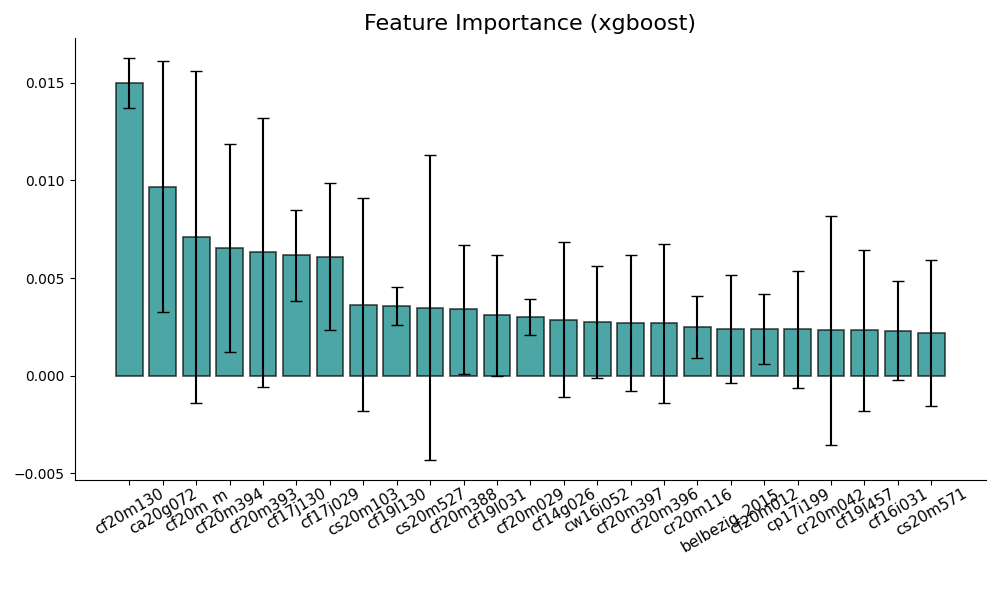

# Social Complexity Lab, PreFer Challenge [1]

We proceed in two steps:
1. **Gradient boosting algorithm (xgboost):**
    - To establish a strong baseline.
    - To evaluate the predictive power of each question.
2. **Our main model is an autoencoder-tabular model:**
    - To capture complex, non-linear relationships in the data.
    - To explore new factors and interactions that traditional gradient boosting models might miss.

## Gradient Boosting as a Baseline

For xgboost, the most important parameters for the prediction task are:
1. `scale_pos_weight` to account for the unbalanced outcome.
2. `reg_lambda` for L2 regularization to avoid overfitting.

xgboost serves as a robust baseline with an `F1-score = 0.71` on the hidden validation set of round 2.

#### What Are the Important Questions?

The most important features/questions are displayed in Fig. 1. The main characteristics of these questions are:
1. `cf` code, indicating `Family & Household` type of questions.
2. `2020` most of the important questions are from the last year of the survey.

The most important question is `Within how many years do you hope to have your [first/next] child? (in 2020)`. This question remains significant across different survey years (cf. Fig. 1). This finding aligns with [2], where the author desmontrate that task-specific information outperforms surveillance-style big data for predicting academic performance. 

<figure>
  
  <figcaption><b>Fig. 1:</b> Feature importance from xgboost, with error bars representing the standard deviation on the feature importance across 50 runs.</figcaption>
</figure>

#### How Much Data/How Many Questions Do We Need?

xgboost requires only the top ~200 questions to achieve the best predictive performance. Performance plateaus and even decline when additional features are included (Fig. 2).

<figure>
  
  <figcaption><b>Fig. 2:</b> Prediction metrics for an increasing number of features, ordered by feature importance (cf. Fig. 1). Each run is cross-validated over 50 80/20 train/test random splits.</figcaption>
</figure>

To mitigate overfitting, we employ cross-validation with an 80/20 split. Fig. 3 shows the distribution of `F1-score`. The mean is around 0.75, which is higher than the 0.71 on the validation set, indicating that the model still overfits despite the heavy regularization parameters.

## TabularEncoder

Our main model, the autoencoder-tabular model, is designed to uncover complex, non-linear interactions between variables that traditional models might overlook. This approach allows us to:
1. Capture latent representations of the data.
2. Improve predictive performance by learning from the entire dataset structure.

## AutoEncoder
In addition to the other models, which we have submitted, we have been experimenting with an AutoEncoder. The AutoEncoder is pretrained and finetuned in the following ways:

### Pretraining and finetuning
The AutoEncoder is pretrained using standard reconstruction loss, where we use an **encoder** to compress the input and a **decoder** to decompress the compressed input and train the model to reconstruct the input. This is done using `CrossEntropyLoss` using the original input and the reconstructed input. 

For finetuning, we drop the decoder and work only with the encoded (compressed) input. Since we have 14 sequences per person, one for each year in the survey (detailed in Data Processing), we encode each sequence into a single vector, representing a highly compression representation of a survey. We then treat the 14 sequences, now compressed as as 14 vectors, as a new temporal sequence which is fed into a GRU.  

## Data Processing

We do a series of data processing steps to convert the tabular data into sequential data, to represent the temporal aspect of the surveys. We create a sequence for each year and tokenize each sequence. We decided to work only with categorical, numeric and date columns, as they are easy to process and represent most of the data. There also exists a file to handle free-text in `data_processing/text2vec`, but this requires an external model (LLM) to create the embeddings, which is why we have chosen not to include it. ß

### Embedding and tokenisation
In order for the deep learning models to understand the data, we must embed it. This requires us to put an integer value to all questions and answers. 

For questions, it is easy: We just group questions asked in multiple surveys and assign each group an integer. 

For the answers, we do this through **tokenisation**, where we convert each answer to a `token`.   
For **categorical** (`data_processing/categorical.py`) answers, we assign each unique answer (accounting for the rephrasing) an integer. This creates the same mapping for an answer (e.g. "yes") that answers two different questions. This allows us to share the vocabulary, decreasing model size and increasing the semantic meaning of each answer.   
For **numeric** or **date or time** (`data_processing/numeric_and_date.py`) we bin the values into percentiles (100 bins), that is again shared between questions to increase the semantic meaning. 

If an individual has not answered a given question, we assign their answer to an unknown token `[UNK]`. 

### Sequential input
As our models require sequential data (so they better fit registry data in phase 2), we must convert the tabular format into sequences. We create a sequence for each year to reflect the temporal aspect of the data. The order of the sequence for each year is kept constant across years, as we have no predefined order. This is done using the `codebook`, where we allocate each question (e.g. cfxxx003) a specific spot in the sequence. This means the question "Gender respondent" will always be at the same index of the sequence across all years. For registry data, the sequence would be ordered in the order in which they appear throughout an individual's life.  

If a question has not been asked for a given year, we still keep its spot in the sequence and assign an unknown token `[UNK]` as the answer for all individuals. 

For the ExcelFormer, we order the sequence based on the feature importance from the XGBoost.

We also allow for subsetting the number of columns through the `custom_pairs` in `data_processing/pipeline.py`. 

# Conclusion 
We compared a common xgboost model with a more advanced machine learning model, which is still uncommon in the social sciences. The xgboost model provided a strong baseline, effectively identifying the most important factors influencing fertility outcomes. Additionally, we quantified the uncertainty of feature predictions using this model.

While the advanced model did not perform on par with xgboost in this phase of the challenge, it demonstrated potential for future improvements. This model has the capacity to be extended to richer registry data [3], which will be explored in phase two of the challenge. Its ability to capture complex, non-linear interactions holds promise for uncovering new insights and advancing our understanding of fertility behavior.

**References:**

[1] Sivak, E., Pankowska, P., Mendrik, A., Emery, T., Garcia-Bernardo, J., Hocuk, S., Karpinska, K., Maineri, A., Mulder, J., Nissim, M., & Stulp, G. (2024). Combining the Strengths of Dutch Survey and Register Data in a Data Challenge to Predict Fertility (PreFer) 
[2] Bjerre-Nielsen, A., Kassarnig, V., Lassen, D. D., & Lehmann, S. (2021). Task-specific information outperforms surveillance-style big data in predictive analytics. *PNAS*
[3] Savcisens, G., Eliassi-Rad, T., Hansen, L. K., Mortensen, L. H., Lilleholt, L., Rogers, A., Zettler, I., & Lehmann, S. (2024). Using sequences of life-events to predict human lives. *Nature Computational Science*